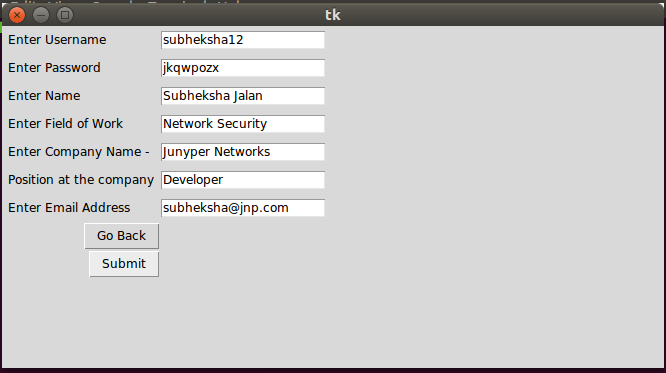
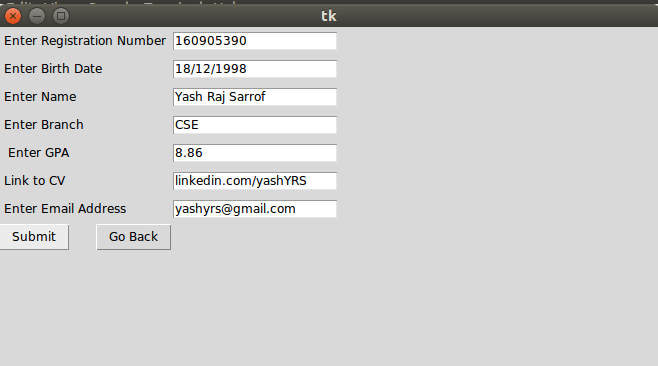
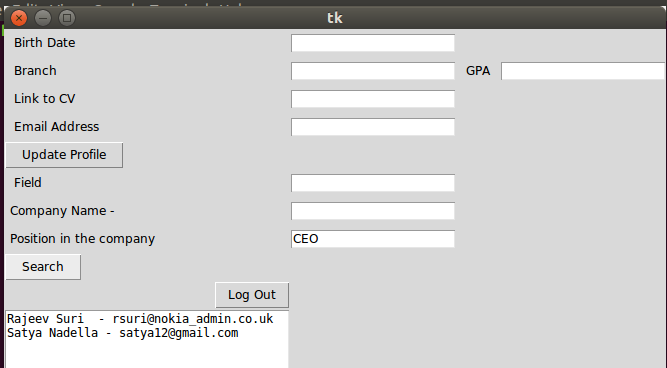
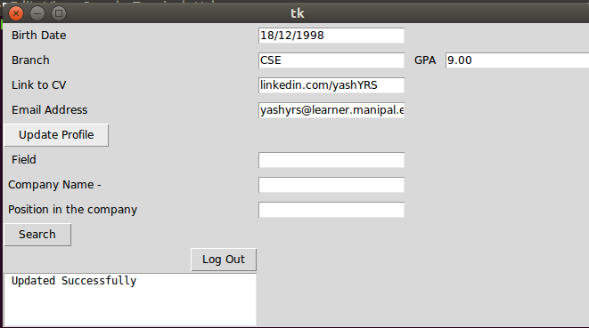

# Alumni_Network
A simplistic database application wherein students of a college can search for Alumni of their college and get their contact details, for references, gaining knowledge about their respective fields or ask any doubts in general about how the industry actually functions, done as a part of the 4th Semester Database Systems Lab Capstone Project. 

## Installation & Usage

1. Clone the repo
   ```sh
   git clone https://github.com/yashyrs/Alumni_Network.git
   ```

2. Make sure, **tkinter** is installed on the system. It should be noted that a virtual environment is not needed to run this application, since it does not use any additional package except tkinter outside of the native modules provided by python.
    ```sh
    # Installation command will vary based on OS
    apt-get install python3-tk
    ```
3. If a database had not been created previously
 ```sh
 python create_tables.py
 ```
4. To launch this application
 ```sh
 python Alumni_Network.py
 ```

## Screenshots from the application 

##### Alumni Registration Page


##### Student Registration Page


##### Sample Query made to find Alumnis by posting


##### Sample Profile Update

